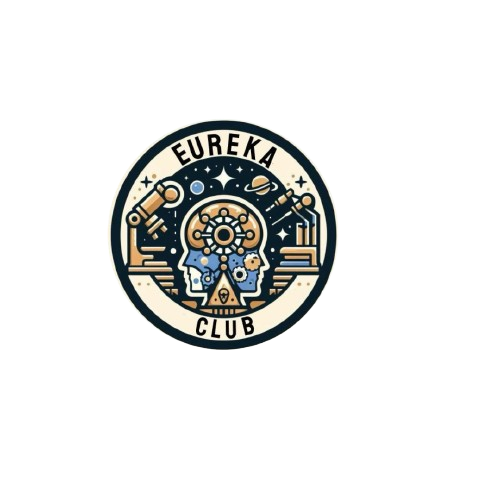

This `README.md` is designed to match the high-end, technical aesthetic of your project. It includes a feature breakdown, technology stack, and instructions for maintaining the dynamic sections.

***

# 🛰️ EUREKA | Technical Collective
> **"Where Human Intelligence Meets Mechanical Precision."**

A cinematic, high-performance web experience for the **Eureka Technical Club**. This project blends cutting-edge web technologies to create a "Technical Operating System" feel, inspired by sci-fi interfaces and modern engineering aesthetics.



## 🌌 Core Features

### 1. Cinematic Visuals
*   **3D Starfield:** An interactive background rendered in real-time using **Three.js**.
*   **Splash Cursor:** A high-performance **WebGL Fluid Simulation** that leaves a trail of "Eureka Gold" ink as you browse.
*   **HUD Interface:** Design elements inspired by Heads-Up Displays, including bracketed corners, scanlines, and monospaced data readouts.

### 2. Advanced Motion
*   **Smooth Scrolling:** Integrated **Lenis** library for weightless, momentum-based scrolling.
*   **Scroll-Triggered Reveals:** GSAP-powered animations that reveal content with cinematic "Expo" easing.
*   **Dynamic Transitions:** Page-to-page transitions that fade to black, simulating a system reboot.

### 3. Professional Sections
*   **Operational Divisions:** Interactive 3D cards for Robotics, AI, and Space Tech.
*   **The Core (Board):** "Cyber-Profile" member cards with hover-activated scanlines.
*   **Operations Center:** Dedicated space for featured upcoming events and a grayscale mission archive.
*   **Hall of Records:** Structured merit section for published research papers and competition awards.

### 4. Dynamic Data Architecture
*   **Universal Template:** A single `team-details.html` file that dynamically generates content based on URL parameters (e.g., `?id=robotics`), making the site incredibly easy to scale.

---

## 🛠️ Technology Stack

| Layer | Technology |
| :--- | :--- |
| **Styling** | Tailwind CSS (Utility-first) |
| **Motion** | GSAP (GreenSock Animation Platform) |
| **3D Engine** | Three.js (WebGL Point Clouds) |
| **Fluid Engine** | WebGL Shader-based Simulation |
| **Typography** | Syncopate (Headers), Space Grotesk (Body), JetBrains Mono (Tech Labels) |
| **Smooth Scroll** | Lenis by Studio Freight |

---

## 🎨 Color Palette (Logo Sampled)
*   **Deep Space Navy:** `#0B1118` (Primary Background)
*   **Eureka Gold:** `#C5A16F` (Primary Accents & Fluid)
*   **Ethereal Blue:** `#A3C4D9` (Secondary Technical Accents)
*   **Off-White:** `#FDF6E3` (Text for Readability)

---

## 🚀 Getting Started

1.  **Clone the Repository:**
    ```bash
    git clone https://github.com/your-username/eureka-club.git
    ```
2.  **Run Locally:**
    Since this project uses WebGL and external scripts, it is best viewed via a local server (like **Live Server** in VS Code).
3.  **Add a New Team:**
    Open `team-details.html` and add a new entry to the `teamsData` JavaScript object. The page will automatically generate the UI for you.

---

## 📂 Project Structure
```text
├── index.html           # Main Cinematic Landing Page
├── team-details.html    # Dynamic Master Template for Divisions
├── assets/              # Logos, Member Images, and Posters
└── js/                  # (Optional) Externalized JS Logic
```

## 📝 Configuration Note
To ensure the **Splash Cursor** and **Three.js Stars** run smoothly, this project requires a browser with WebGL 2.0 support (Chrome, Firefox, Safari 15+).

---

## 🛡️ License
Distributed under the MIT License. See `LICENSE` for more information.

**System Status: [ STABLE ]**  
**Eureka Technical Club // Beyond Boundaries**
## Creater
**Name :Sayujya Tiwari** 